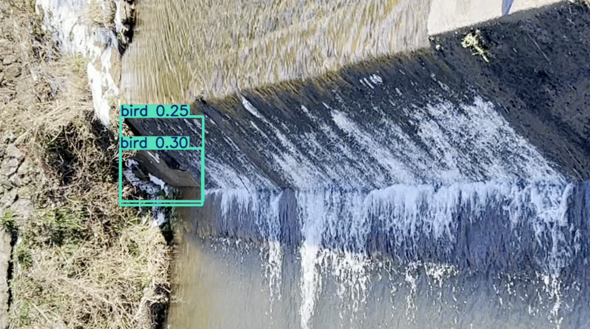

## YOLO11n/YOLO5n MOV Detection Example



## System Overview

This project is a wild animal detection system using Jetson Orin Nano, YOLO11n, a NoIR camera, IR LED lighting, LTE notification, Firebase messaging, and an iOS app.

```text
NoIR Camera
    ↓
Jetson Orin Nano / Ubuntu 22.04
    ↓
YOLO11n Object Detection
    ↓
Animal Detection Event
    ↓
LTE Network / Soracom USB dongle
    ↓
Firebase Realtime Database / Firebase Cloud Messaging
    ↓
iOS App Notification
